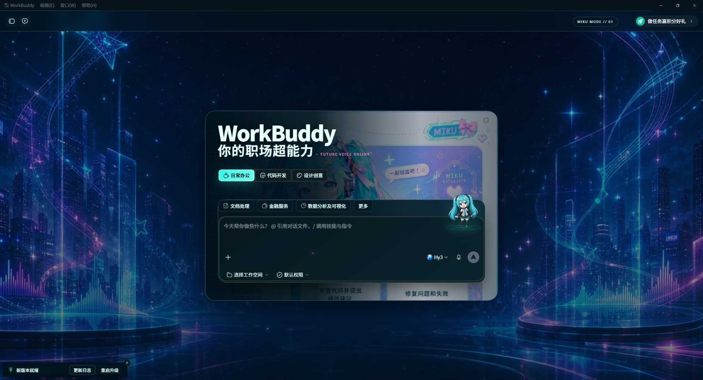

# WorkBuddy Skins

一个面向 Windows WorkBuddy 桌面客户端的非侵入式皮肤工具仓库，当前提供「MIKU MODE 01」全页面主题，以及用于继续开发 WorkBuddy 皮肤的 Codex Skill。

> 当前版本：v1.8.3 · 已验证 WorkBuddy 5.2.5–5.2.6 · Windows 10/11 64 位

<p align="center">
  
</p>

## 效果预览

<p align="center">
  
</p>

> 深色模式的新建任务页：独立舞台背景、初音主题主卡片和固定位置的 Q 版动画人物。截图时已隐藏任务列表，避免包含本地任务信息。

## 功能

- 覆盖首页、侧栏、任务会话、项目、专家/技能/连接器、自动化、设置、菜单、弹窗与首次任务准备页。
- 支持 WorkBuddy 深色和浅色外观，并在页面跳转与重启后保留选择。
- 新建任务页、聊天区和等待页使用不同背景素材。
- 右侧 Markdown/Word 产物预览完整适配标签栏、标题、操作按钮、正文、引用、代码与表格，支持深浅色模式。
- 任务执行期间显示慢速 Q 版角色动画；人物中心与地面基线逐帧锁定，不会在舞台上漂移。
- 系统启用“减少动态效果”时自动切换为静态首帧。
- 不修改 `WorkBuddy.exe` 或 `resources/app.asar`，可随时恢复原界面。
- 附带 `$build-workbuddy-skins` Skill，用于审计 DOM、开发主题、修复显示问题、构建动画和发布新皮肤。

## 快速开始

### 环境要求

- Windows 10 或 Windows 11 64 位
- 已安装并至少正常启动过一次 WorkBuddy
- 当前适配版本：WorkBuddy 5.2.5–5.2.6

### 安装皮肤

```powershell
git clone https://github.com/wangqd71/workbuddyskins.git
cd workbuddyskins\skin-tool
.\打开换肤工具.cmd
```

在工具窗口中点击“应用初音皮肤”。如果 WorkBuddy 正在运行，请先保存未发送的输入，再允许工具重启客户端。

不使用 Git 时，也可以从 GitHub 下载仓库 ZIP，完整解压后双击 `skin-tool/打开换肤工具.cmd`。

### 恢复原界面

再次打开换肤工具，点击“恢复原始界面”。工具会停止本地注入进程、清除皮肤偏好并正常启动 WorkBuddy。

## 仓库结构

```text
workbuddyskins/
├── README.md
├── skin-tool/                     # 可运行的 v1.8.3 皮肤工具与源码
│   ├── assets/miku/               # 主题、背景和动画素材
│   ├── scripts/                   # CDP 注入器、控制器和审计/动画脚本
│   ├── tests/                     # PowerShell 与运行时回退测试
│   ├── build-release.ps1          # 分享包构建脚本
│   └── 打开换肤工具.cmd
└── skills/
    └── build-workbuddy-skins/     # 可安装的 Codex Skill
```

## 使用 Codex Skill

将 skill 复制到 Codex 技能目录：

```powershell
$target = Join-Path $env:USERPROFILE '.codex\skills\build-workbuddy-skins'
Copy-Item -Recurse -Force '.\skills\build-workbuddy-skins' $target
```

之后在 Codex 中使用：

```text
使用 $build-workbuddy-skins 给 WorkBuddy 制作一个新的角色皮肤
```

Skill 内置两类脚本：

- `audit-workbuddy.mjs`：通过本地 CDP 执行 DOM 快照、计算样式检查、点击与截图。
- `build-anchored-animation.py`：将透明精灵表生成带缓动、中心锁定和地面基线锁定的 WebP 动画。

## 开发与验证

在 `skin-tool` 目录运行：

```powershell
powershell -NoProfile -ExecutionPolicy Bypass -File .\tests\run-tests.ps1
powershell -NoProfile -ExecutionPolicy Bypass -File .\scripts\workbuddy-skin.ps1 -Action Verify
powershell -NoProfile -ExecutionPolicy Bypass -File .\build-release.ps1
```

控制器支持：

```powershell
# 应用并重启正在运行的 WorkBuddy
powershell -NoProfile -ExecutionPolicy Bypass -File .\scripts\workbuddy-skin.ps1 -Action Apply -RestartExisting

# 查看状态
powershell -NoProfile -ExecutionPolicy Bypass -File .\scripts\workbuddy-skin.ps1 -Action Status

# 恢复原界面
powershell -NoProfile -ExecutionPolicy Bypass -File .\scripts\workbuddy-skin.ps1 -Action Restore
```

## 工作原理与安全边界

工具使用 WorkBuddy/Chromium 的 DevTools Protocol 注入 CSS 和本地图片 Data URI，调试端口仅绑定 `127.0.0.1`。运行时会存在一个隐藏的本地 Node.js 注入进程；恢复原界面后该进程会停止。

- 不改写 WorkBuddy 安装文件。
- 不读取或修改账号数据和聊天记录。
- WorkBuddy 升级后，页面结构和类名可能变化，需要重新适配。
- “检查皮肤”生成的截图可能包含任务名称，请勿直接公开上传。
- 只运行来自可信来源的原始仓库或发布包。

## 素材与许可

本项目是非官方、非商业的本地界面主题，不隶属于 WorkBuddy、Crypton Future Media 或初音未来官方。

角色相关二次创作请遵守 [Piapro 角色使用指南](https://piapro.jp/license/character_guideline) 与 [PCL 摘要](https://piapro.jp/license/pcl/summary)。详细说明见 [`skin-tool/素材与许可说明.txt`](skin-tool/素材与许可说明.txt)。仓库未附带统一开源许可证时，不代表自动授予代码或素材的再许可权；公开分发或商业使用前请自行核对授权。

## 免责声明

本工具依赖 WorkBuddy 当前客户端实现，使用前请保存重要工作内容。项目维护者不对客户端升级、企业安全策略或第三方素材授权变化造成的兼容性问题负责。
